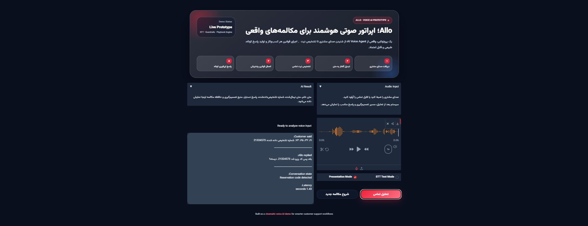

# Sira Realtime Voice Agent



Sira is a realtime multilingual AI voice agent prototype for natural business phone conversations.


It combines live browser audio streaming, speech-to-text, intent routing, playbook-based business logic, guardrails, and conversational AI responses.


\## What it does


\- Streams microphone audio from the browser through WebSocket

\- Transcribes speech using faster-whisper

\- Detects user intent and routes conversations

\- Follows business-specific playbooks and rules

\- Handles reservation codes, phone numbers, confirmations, and retries

\- Supports Persian and English, with multilingual expansion in mind

\- Provides a polished Gradio demo UI and a realtime WebSocket demo


\## Core Features


\- Realtime audio streaming

\- Live transcript rendering

\- AI response bubbles

\- Persian STT normalization layer

\- Number and reservation-code parsing

\- Guardrails for out-of-domain questions

\- Playbook-driven conversation flows

\- Modular backend structure


\## Architecture


```text

Browser Microphone

&nbsp;     ↓

WebSocket Audio Stream

&nbsp;     ↓

Realtime STT Pipeline

&nbsp;     ↓

Normalization Layer

&nbsp;     ↓

Intent / Playbook Engine

&nbsp;     ↓

AI Response Orchestration

&nbsp;     ↓

Live Conversation UI

## Configuration

Sira is moving from local demo-specific settings toward a configurable, workspace-based architecture.

The project supports environment-based configuration through `.env` values.  
Use `.env.example` as the reference file:

```bash
cp .env.example .env
```

On Windows PowerShell:

```powershell
Copy-Item .env.example .env
```

### Workspace and business config

By default, Sira uses the Cinematicket demo workspace:

```env
SIRA_WORKSPACE_ID=cinematicket
```

Runtime config files are loaded from:

```text
businesses/{workspace_id}/agent.yaml
businesses/{workspace_id}/playbook.yaml
```

For the current demo, this means:

```text
businesses/cinematicket/agent.yaml
businesses/cinematicket/playbook.yaml
```

### Agent identity

The agent name is intentionally not hardcoded.

In the current demo config, the agent identity is defined as:

```yaml
agent:
  name: null
  name_source: "dashboard"
```

This keeps the backend ready for the future dashboard, where each business will be able to choose its own AI agent name and identity.

### Speech-to-text config

Whisper/STT settings can be configured with:

```env
WHISPER_MODEL_PATH=models/faster-whisper-large-v3
STT_DEVICE=cuda
STT_COMPUTE_TYPE=float16
```

### Ollama config

The local LLM endpoint can be configured with:

```env
OLLAMA_MODEL=qwen-callcenter
OLLAMA_URL=http://localhost:11434/api/generate
```

### Notes

- `.env` should not be committed.
- `.env.example` should be committed as the public reference.
- Sira is the platform name.
- The spoken assistant/agent name should come from business configuration or the dashboard, not from hardcoded backend logic.
- Cinematicket is currently the demo workspace, not the full product identity.